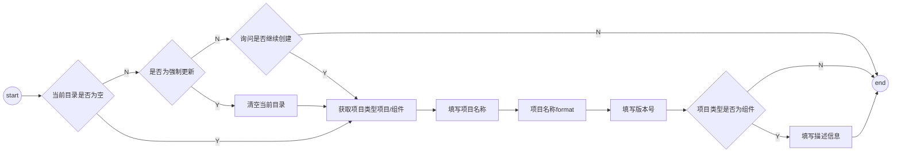

### 记录命令

```
yaotou init projectName -f -d -tp /Users/yaotou/Documents/program/mine/github/muke/yaotou/commands/init
```

- path-exists@4.0.0 老装不上，老是 5.0.0
  - 已解决: 根目录下，package-lock.json path-exists 5.0.0 -> 4.0.0
- 项目根目录下 node_modules 下@yaotou/core 每次 npm 安装包，或者 lerna 安装包时，就会出来

- 脚手架项目创建功能步骤



### ejs

- <% js 标签
- <%\_ %>删除前面的空格
- <%= 输出数据
- <%- 输出非转义字符
- <%# 注释
- <%% %%> 输出字符串 '<%'
- <%- include(filePath, data) -%>

options:

- delimiter: defalut: % (可以修改%)

ejs.fileLoader:

- 类似 webpack loader

### package.json

- files 字段: npm publish 时，上传到 npm 的目录或文件
